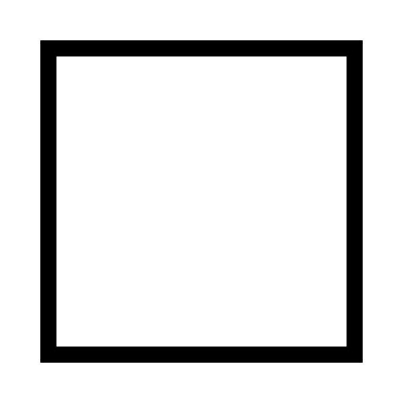

# ar-qr-tracer

Trace physical QR codes in real life using Augmented Reality. Optimized for mobile (iOS/Android) and designed for artists, designers, and anyone needing to accurately place QR codes on physical surfaces.

## Features
- **Real-time QR Generation**: Type text directly in the app to generate a QR code instantly.
- **Custom Image Support**: Upload existing QR code images from your device.
- **Precision Anchoring**: The QR code anchors at its **bottom-left corner**, making it perfect for precise physical alignment.
- **Mobile Optimized**: Smooth tracking and pinch-to-scale gestures designed for Safari (iOS) and Chrome (Android).
- **Standalone Mode**: No external libraries required for QR generation—runs entirely in your browser.

## How to Use
1. **Draw the Marker**: Draw the square pattern (see image above) on the surface where you want the QR code.
2. **Open the App**: Visit the [GitHub Pages link](https://ryanraposo.github.io/ar-qr-tracer/) in Safari or Chrome.
3. **Generate or Upload**: Type text into the bottom input field or choose a file.
4. **Align and Scale**: Point your camera at the marker. Use a pinch gesture to scale the QR code from its bottom-left anchor point.
5. **Trace**: Use the low-opacity overlay to trace the QR code onto your surface.

## Development
- **index.html**: Main AR application using A-Frame and AR.js.
- **qr-generator.js**: A hand-written QR generation algorithm (Version 1, Byte Mode).
- **pattern-marker.patt**: The AR.js pattern file for tracking.

---
*Created for precision physical tracing.*
